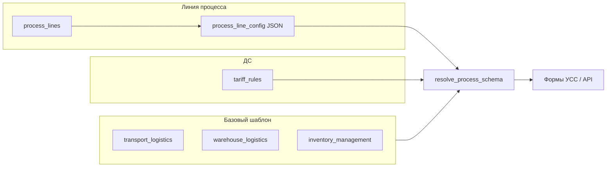

# Архитектура портала ПЛС

Портал объединяет **УЗнТ** (заявки на транспортировку) и **УСС** (операционный учёт и биллинг ОХ).

## Слои

```
┌─────────────────────────────────────────────────────────────┐
│  UI (HTML/JS) — /uss/*, /admin/*, заглушки УЗнТ           │
├─────────────────────────────────────────────────────────────┤
│  API — /api/reference, /api/process-lines, /api/uss, …    │
├──────────────┬──────────────────────┬─────────────────────┤
│ Справочники  │ Конфигураторы        │ Операции УСС        │
│ reference/   │ processes/           │ uss/                │
├──────────────┴──────────────────────┴─────────────────────┤
│  Core: auth, SSO, permissions (email → роли → секции)      │
├─────────────────────────────────────────────────────────────┤
│  PostgreSQL + Alembic                                       │
└─────────────────────────────────────────────────────────────┘
```

## Справочники

Каталоги в `app/modules/reference/`:

| Каталог | Сущность | API |
|---------|----------|-----|
| clients | Клиенты | `GET/POST /api/reference/clients` |
| contracts | Договоры | `/api/reference/contracts` |
| amendments | ДС | `/api/reference/amendments` |
| warehouses | Локации/склады | `/api/reference/warehouses` |
| tariff_codes | Ставки (`tariff_rules`) | `/api/reference/tariff_codes` |
| units | Единицы измерения | `/api/reference/units` |
| staff | Должности | `/api/reference/staff` |
| vehicles | Госномера | `/api/reference/vehicles` |
| roles | Роли | `/api/reference/roles` |

Права: `app/core/permissions.py` → `REFERENCE_SECTIONS`, `USS_SECTIONS`.

## Конфигураторы процессов

Базовые шаблоны (код, не fork на клиента):

| `base_process` | Секции | Таблицы |
|----------------|--------|---------|
| `transport_logistics` | vehicle_operations, period_inputs, day_confirm | `vehicle_operations`, `operation_daily_totals` |
| `warehouse_logistics` | period_inputs, day_confirm | `operation_daily_totals` |
| `inventory_management` | inventory_areas, inventory_extra, period_inputs, day_confirm | `shift_reports`, `operation_daily_totals` |

Линия процесса (`process_lines` + `process_line_config.config_json`) добавляет «изюминку»:

- дополнительные `billing_line_code`
- поля формы и `validation_rules`
- `ui_labels` без изменения Python-кода

Слияние: `resolve_process_schema(line_id)` → UI и API сохранения.

## SSO

Windows / IIS: заголовок `Remote-User` → нормализация в email → пользователь в `users` + роли в `user_roles`.

Режимы: `SSO_MODE=headers|windows|oidc`, dev bypass: `SSO_DEV_IDENTITY`.

## Модель данных

Каноническая спецификация: [`BILLING_DATA_ROLES.md`](./BILLING_DATA_ROLES.md).

## Диаграмма потока схемы


